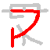
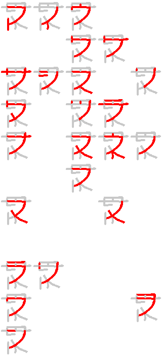

# KanaSegment

Attempting to design a 16-segment display optimized for katakana characters.

## Input

KanaSegment requires a group of similarly named input files with the following file extensions:

### `<filename>.seg.png`

Graphical representation of segments to be used.

- PNG format, arbitrary pixel dimensions
- Background must be white (`#FFFFFF`)
- All pixels of a segment must have the same (arbitrary) color
- Touching segments must have different colors
- Black (`#000000`) is reserved for annotations which will be removed in the final image; this is helpful to number the segments directly inside the image
- The code allows configuring background, active and inactive segment color in the generated images

Example:


### `<filename>.seg.txt`

Describes the position of each segment. 
- One line per segment, containing coordinates to one (arbitrary) pixel within a segment. 
- The segment number is implicit in the line number (starting with 1) 

Example (see [`v0.seg.txt`](../designs/v0/v0.seg.txt)):
```
22,6
13,9
31,10
...
```

### `<filename>.chars.txt`

Describes which character uses which segments.

- One line per character.
- Three entries per line, separated by one or more spaces
  - Rōmaji reading of character (used for output file names)
  - Kana character
  - List of segments used by that character, separated by commas, order is arbitrary
- Characters that are not supported can omit the list of segments
- Leave empty lines for non-existent characters (useful for the Y, W and N groups)

Example (see [`v0.chars.txt`](../designs/v0/v0.chars.txt)):
```
a   ア  6,7,11,14,13
i   イ  11,14,15
u   ウ  3,9,6,7,11,14
e   エ
o   オ  
...
```

### `<filename>.cfg.yml`

Example (see [`v0.cfg.yml`](../designs/v0/v0.cfg.yml)):


## Output

### Individual characters

For each character that includes a segment list, an image is generated.

Example:



### Overview

A tiled overview showing all supported characters is also generated.

Example:


